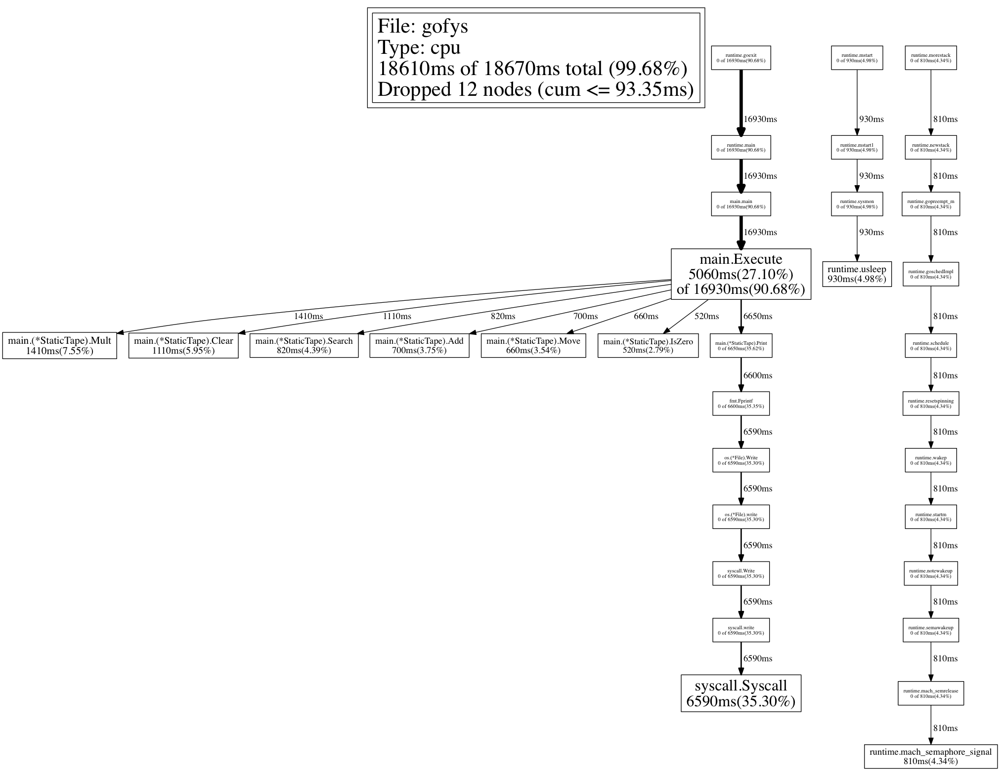
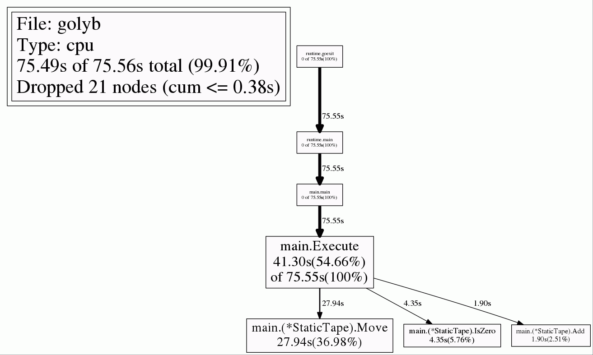
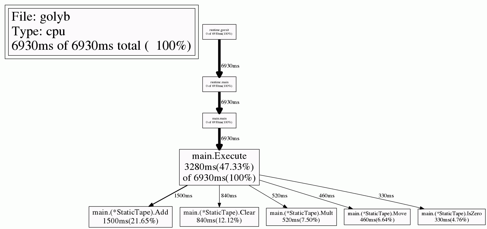
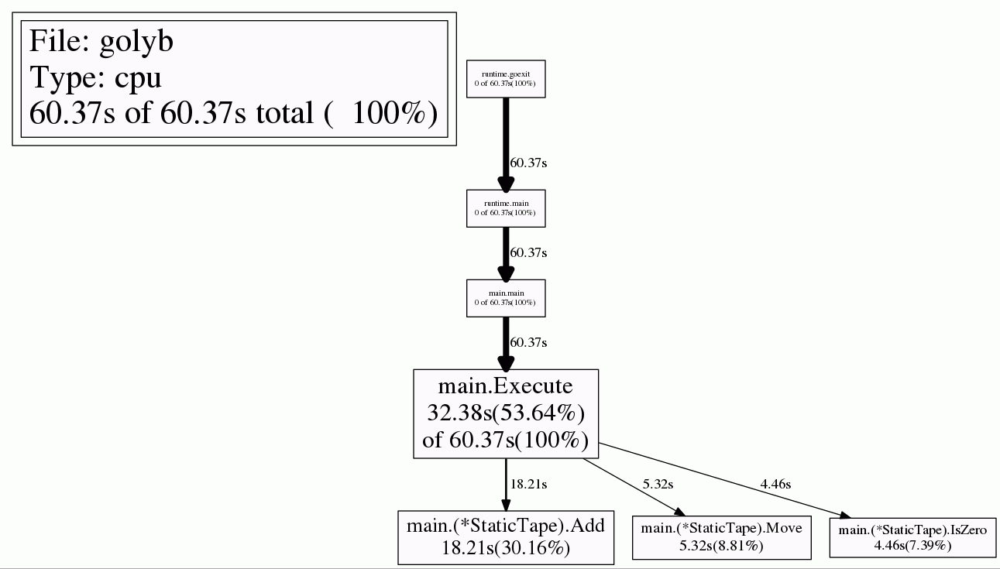
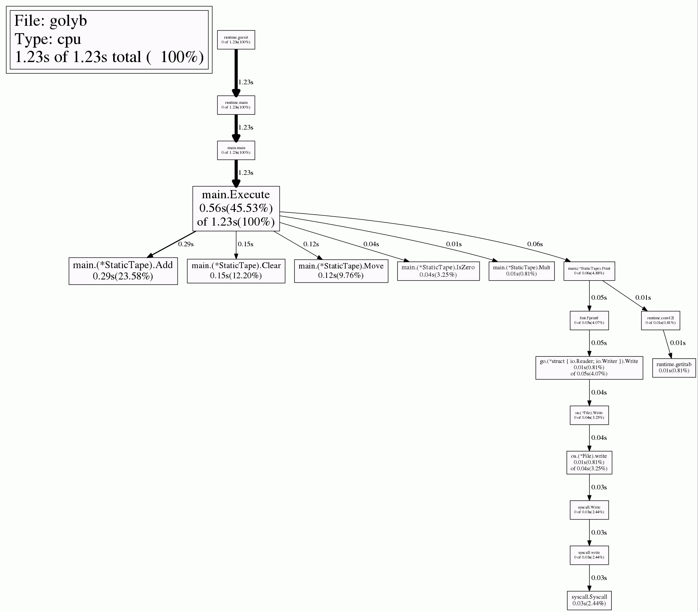
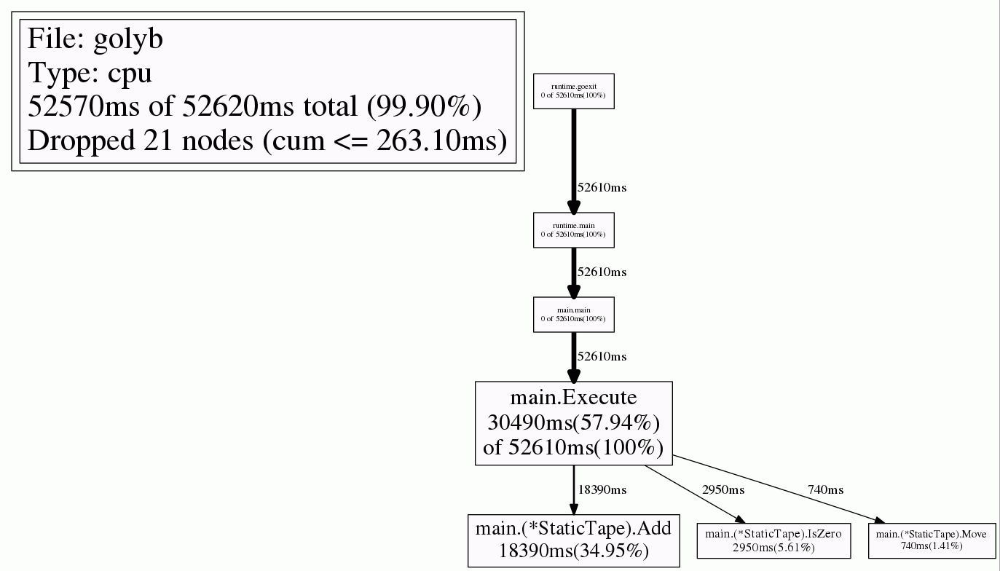

[](https://travis-ci.org/dim13/golyb)
[](https://godoc.org/github.com/dim13/golyb)

# Go love your brain
Yet another optimizing BrainF\*ck interpreter in Go

## Installation
    go get github.com/dim13/golyb/cmd/golyb

## Usage
```
Usage of golyb:
  -dump
    	Dump AST and terminate
  -file string
    	Source file (required)
  -in string
    	Input file
  -noop
    	Disable optimization
  -out string
    	Output file or /dev/null
  -profile string
    	Write CPU profile to file
  -show
    	Dump tape cells
  -tape value
    	Tape type: static or dynamic (default static)
```

## Tape storage type
- static: 32k byte cells including 1k margin on the lower end (used by default)
- dynamic: int cells allocated in 1k chunks as required on access

# Code optimization
- [x] Contraction
- [x] Clear loops
- [x] Copy loops
- [x] Multiplication loops
- [x] Scan loops (kind of)
- [x] Operation offsets
- [x] Reduce NOPs

Reference: http://calmerthanyouare.org/2015/01/07/optimizing-brainfuck.html

## Some rough results

| Program     | w/o optimization | with optimization | speed gain |
| -----------:| ----------------:| -----------------:| ----------:|
| madelbrot.b |         52.3 sec |          11.8 sec |       4.4x |
| long.b      |         48.5 sec |           5.4 sec |       9.0x |
| hanoi.b     |         47.0 sec |           1.0 sec |      47.0x |
| bench.b     |          6.6 sec |           1.1 sec |       6.0x |

Executed on 1.3 GHz Intel Core i5

## CPU profiles

### mandelbrot.b
#### optimized

#### not optimized


### long.b
#### optimized

#### not optimized


### hanoi.b
#### optimized

#### not optimized

